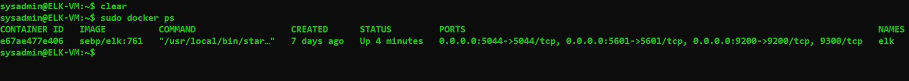

## **Automated ELK Stack Deployment**

The files in this repository were used to configure the network depicted below.


These files have been tested and used to generate a live ELK deployment on Azure. They can be used to either recreate the entire deployment pictured above. Alternatively, select portions of the YAML file may be used to install only certain pieces of it, such as Filebeat.

- ELK Stack Ansible playbook file:
  - [install-elk-playbook.yml](/Ansible/install-elk-playbook.yml)<p></p>

- Filebeat Ansible playbook and configuration files:
  - [filebeat-playbook.yml](/Ansible/filebeat-playbook.yml)
  - [filebeat-config.yml](/Ansible/filebeat-config.yml)<p></p>

- Metricbeat Ansible playbook and configuration files:
  - [metricbeat-playbook.yml](/Ansible/metricbeat-playbook.yml)
  - [metricbeat-config.yml](/Ansible/metricbeat-config.yml) <p></p>

This document contains the following details:
- Description of the Topology
- Access Policies
- ELK Configuration
  - Beats in Use
  - Machines Being Monitored
- How to Use the Ansible Build <p></p>


### **Description of the Topology**

The main purpose of this network is to expose a load-balanced and monitored instance of DVWA, the D*mn Vulnerable Web Application.

Load balancing ensures that the application will be highly available, in addition to restricting traffic overload to the network.
- Load balancer mitigate availability attacks like Denial of Service (DoS attacks) by distributing traffic evenly across multiple servers hosting the same application  

Having a jump box is in essence indistinguishable to a gateway router:
- It forces traffic through a single node that can monitor and secure other individual VMs in the network(s), only worrying about a few connections between a few machines instead of all machines connections. 

- Since the jump box is the only VM with a public IP, it connects to the other VM through a private IP by secured port 22 (SSH) which prevent the other VMs in the network from being exposed to the public internet.

Integrating an ELK server allows users to easily monitor the vulnerable VMs for changes to the data and system logs.

- Filebeat is a lightweight shipper for forwarding and centralizing log data
- Metricbeat is a lightweight shipper for metric data

The configuration details of each machine may be found below.


| Name     | Function | IP Address | Operating System |
|----------|----------|------------|------------------|
| Jump Box | Gateway  | 10.0.0.4   | Linux (Ubantu)   |
| Web-1    | Hosting  | 10.0.0.5   | Linux (Ubantu)   |
| Web-2    | Hosting  | 10.0.0.6   | Linux (Ubantu)   |
| ELK-VM   |Monitoring| 10.1.0.4   | Linux (Ubantu)   |

<p></p>

### **Access Policies**

The machines on the internal network are not exposed to the public Internet. 

Only the jump box machine can accept connections from the Internet. Access to this machine is only allowed from the following IP addresses:
- Local_Host IP (Public) 

Machines within the network can only be accessed by SSH.
- Jump box IP 10.0.0.4 can access the ELK-VM via SSH sysadmin@10.1.0.4

A summary of the access policies in place can be found in the table below.

| Name     | Publicly Accessible | Allowed IP Addresses |
|----------|---------------------|----------------------|
| Jump Box (JB) |        Yes          |Local_Host IP 10.0.0.5 10.0.0.6 10.1.0.4|
|   Web-1  |         No          |  10.0.0.4 10.1.0.4   |
|   Web-2  |         No          |  10.0.0.4 10.1.0.4   |
|  ELK-VM  |         No          |  10.0.0.4 10.0.0.5 10.0.0.6|
|Load Balancer (LB)|      No          |10.0.0.5 10.0.0.6|

<p></p>

### **Elk Configuration**

Ansible was used to automate configuration of the ELK machine. No configuration was performed manually, which is advantageous because:
- It vastly reduces the potential for human error in deployment and allows for effortless configuration of potentially hundreds of identical machines all at once.

The playbook implements the following tasks:
- Install docker.io
- Install python3-pip
- Install docker module
- Increases virtual memory 
- Download and launch a docker elk container
- Enable service docker on boot

The following screenshot displays the result of running `docker ps` after successfully configuring the ELK instance.



### **Target Machines & Beats**
This ELK server is configured to monitor the following machines:

```
[webservers]
    10.0.0.5 ansible_python_interpreter=/usr/bin/python3
	10.0.0.6 ansible_python_interpreter=/usr/bin/python3
```

We have installed the following Beats on these machines:
- Filebeat
- Metricbeat

These Beats allow us to collect the following information from each machine:

- Filebeat: 
  - Monitors user or system specified log files or locations, collects log events and forwards them to the ELK stack for processing or indexing<p></p>

- Metricbeat: 
  - Monitors by collecting metric data for a system and service running on a server and forwards them to the ELK stack for processing and statistics<p></p>

### **Using the Playbook**
In order to use the playbook, you will need to have an Ansible control node already configured. Assuming you have such a control node provisioned: 

SSH into the control node and follow the steps below:
- `$ sudo docker start container list -a` &nbsp;-To look for Ansible configured container 
- `$ sudo docker start [container_name]` &nbsp;&nbsp;&nbsp;-To start using container 
- `$ sudo docker attach [contanier_name]`&nbsp;&nbsp;-To get a bash shell of the container

Now you should be in the Ansible container shell, continue to the next step.
<p>Download the YAML files from the Anisble folder in this repository.</p> 

**Installing the ELK container**
- Copy the [install-elk-playbook.yml](/Ansible/install-elk-playbook.yml) file to `/etc/ansible/roles`
- Update the ansible hosts file to include the ELK-VM IP address like so:
 
  - `$ nano /etc/ansible/hosts`
```
        [webservers]
            #alpha.example.org
            #beta.example.org
            #192.168.1.100
            #192.168.1.110
            10.0.0.5 ansible_python_interpreter=/usr/bin/python3
            10.0.0.6 ansible_python_interpreter=/usr/bin/python3

        [elk]
            10.1.0.4 ansible_python_interpreter=/usr/bin/python3
```
- Run the playbook 
  - `$ ansible-playbook /etc/ansible/roles/install-elk-playbook.yml` <br></br>
  
- Navigate to `Your_ELK-VM_Public_IP:5601` to check that the installation worked as expected.
 
  - Example URL:&ensp;`98.208.38.202:5601`

**Installing Filebeat container**
- Copy the [filebeat-playbook.yml](/Ansible/filebeat-playbook.yml) file to `/etc/ansible/roles`
- Copy the [filebeat-config.yml](/Ansible/filebeat-config.yml) file to `/etc/ansible/files`
- Update the filebeat-config file to reflect ELK-VM's current IP address:
  
  - `$ nano /etc/ansible/files/filebeat-config.yml`
```
Line #1106
      
      output.elasticsearch:
      hosts: ["10.1.0.4:9200"]
      username: "elastic"
      password: "changeme"

Line #1806
      
      setup.kibana:
      host: "10.1.0.4:5601"
```
- Run the playbook,
  - `$ ansible-playbook /etc/ansible/roles/filebeat-playbook.yml`<br></br>

- Then navigate to your ELK server's IP address:
  - Click Add Log Data.
  - Choose System Logs.
  - Click on the DEB tab
  - Scroll to Step 5: Module Status and click Check Data.
  - Scroll to the bottom of the page and click Verify Incoming Data.

If installation is successful it will appear as below: 
<br></br>

**Installing MetricBeat container**
- Copy the [metricbeat-playbook.yml](/Ansible/metricbeat-playbook.yml) file to `/etc/ansible/roles`
- Copy the [metricbeat-config.yml](/Ansible/metricbeat-config.yml) file to `/etc/ansible/files`
- Update the metricbeat-config file to reflect ELK-VM's current IP address:
  
  - `$ nano /etc/ansible/files/metricbeat-config.yml`
```
Line #95
      
      output.elasticsearch:
      hosts: ["10.1.0.4:9200"]
      username: "elastic"
      password: "changeme"

Line #61
      
      setup.kibana:
      host: "10.1.0.4:5601"
```
- Run the playbook
  - `$ ansible-playbook /etc/ansible/roles/metricbeat-playbook.yml`<br></br>

- Then navigate to your ELK server's IP address:
  - Click Add Metric Data.
  - Choose Docker Metrics.
  - Click on the DEB tab
  - Scroll to Step 5: Module Status and click Check Data.
  - Scroll to the bottom of the page and click Docker metrics dashboard.

If installation is successful it will appear as below: 

